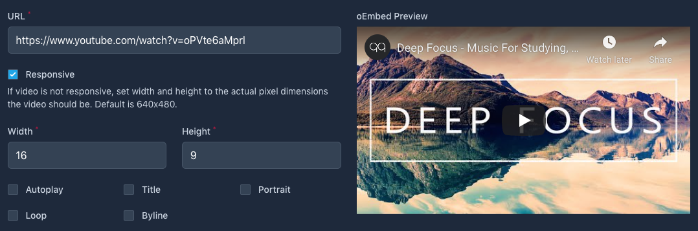

# A collection of components to extend Filament Admin.

[](https://packagist.org/packages/awcodes/filament-oembed)
[](https://packagist.org/packages/awcodes/filament-oembed)

## Installation

You can install the package via composer:

```bash
composer require awcodes/filament-oembed
```

Optionally, you can publish the views, assets or translations using:

```bash
php artisan vendor:publish --tag=filament-oembed-assets
php artisan vendor:publish --tag=filament-oembed-translations
php artisan vendor:publish --tag=filament-oembed-views
```

## Theming

If you are using a custom theme for Filament you will need to add this plugin's views to your Tailwind CSS config. Once this is done you may disable the plugin's stylesheet in the config file by changing 'load_styles' to false.

```js
content: [
    ...
    "./vendor/awcodes/filament-oembed/resources/views/**/*.blade.php",
],
```
### Usage



Allows an oEmbed video with preview. ***Only supports YouTube and Vimeo
at the moment.***

```php
use Awcodes\FilamentOembed\Forms\Components\OEmbed;

OEmbed::make(string $fieldname)
```

## Changelog

Please see [CHANGELOG](CHANGELOG.md) for more information on what has changed recently.

## Contributing

Please see [CONTRIBUTING](.github/CONTRIBUTING.md) for details.

## Security Vulnerabilities

Please review [our security policy](../../security/policy) on how to report security vulnerabilities.

## Credits

- [Adam Weston](https://github.com/awcodes)
- [All Contributors](../../contributors)

## License

The MIT License (MIT). Please see [License File](LICENSE.md) for more information.
